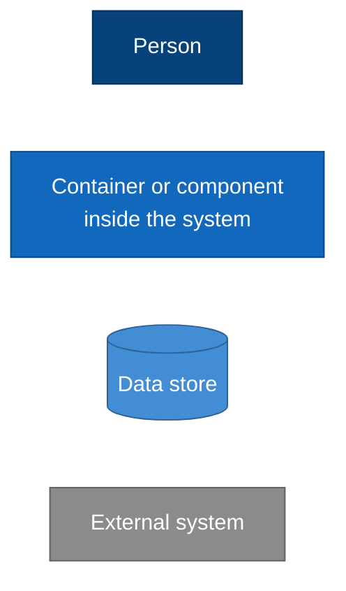
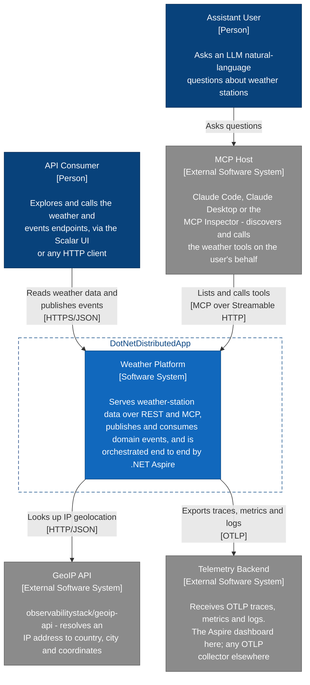
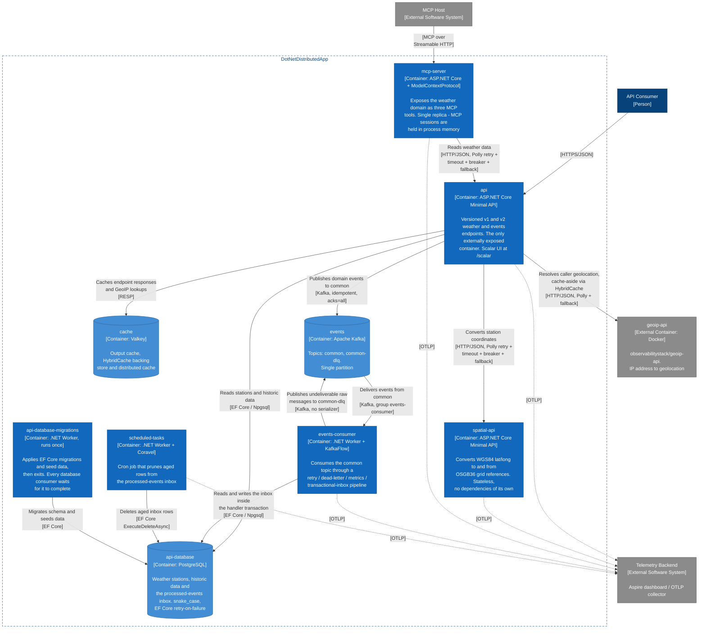
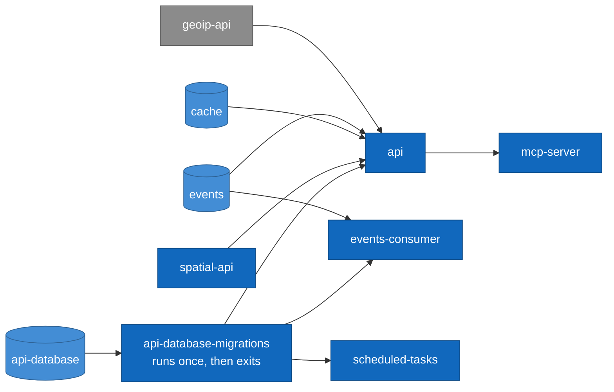
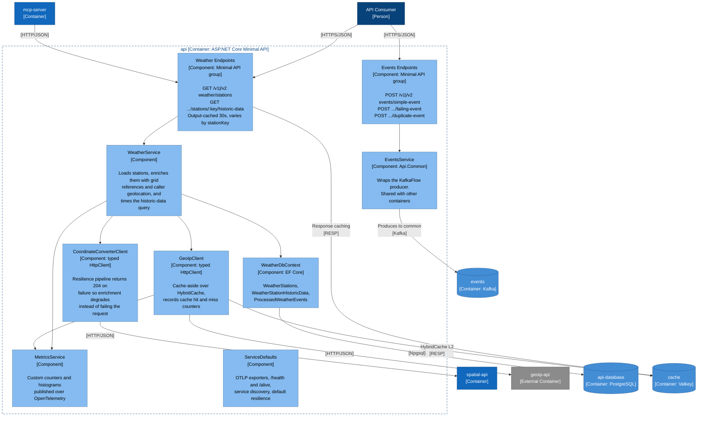
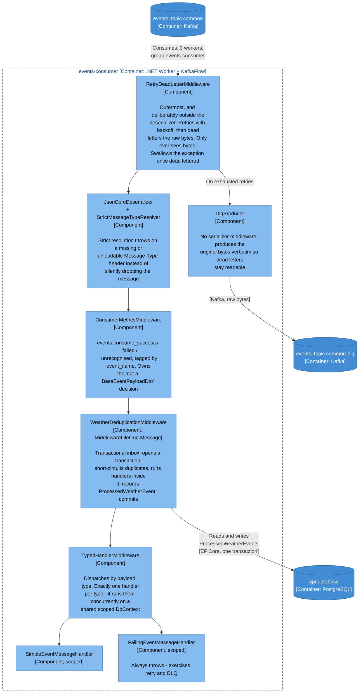
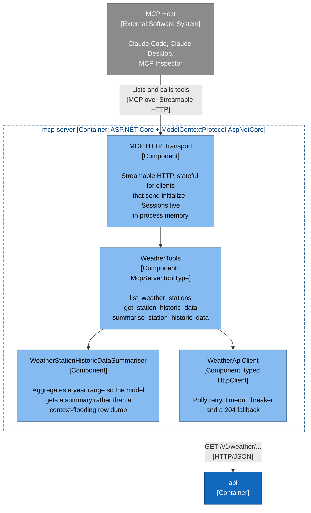
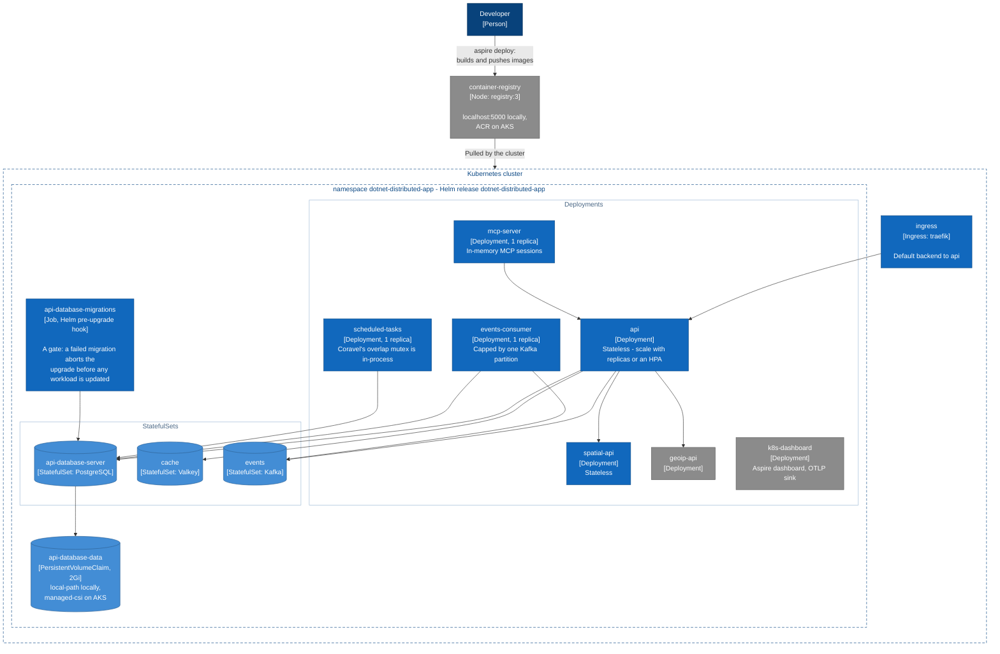

# Architecture

A [C4 model](https://c4model.com) of DotNetDistributedApp, described in Mermaid so that it renders
in the GitHub UI with no tooling. See [Rendering these diagrams](#rendering-these-diagrams) for how
to view them locally and for the optional interactive Structurizr model.

Levels 1-3 are here. Level 4 (code) is deliberately absent - the source is the better answer at
that zoom level.

| Level | Diagram | Answers |
|-------|---------|---------|
| 1 | [System Context](#level-1-system-context) | Who uses the system and what does it depend on? |
| 2 | [Containers](#level-2-containers) | What are the deployable pieces and how do they talk? |
| 3 | [Components: `api`](#level-3-components---api) | How is the REST API put together? |
| 3 | [Components: `events-consumer`](#level-3-components---events-consumer) | Why is the Kafka pipeline ordered the way it is? |
| 3 | [Components: `mcp-server`](#level-3-components---mcp-server) | How is the domain exposed to an LLM? |
| - | [Deployment](#deployment-kubernetes) | What does the Helm chart actually install? |

Colour convention, used consistently throughout:



---

## Level 1: System Context

The system serves UK weather-station data. It has two kinds of human user, and reaches outside
itself for IP geolocation and for telemetry.



## Level 2: Containers

Every box below is a resource in `src/DotNetDistributedApp.AppHost/AppHost.cs` - that file is the
authoritative dependency graph, and this diagram is a reading of it. Names match `ResourceNames.cs`.

`geoip-api` is drawn as external because it is a third-party image the app model happens to host;
it is not code in this repository.



### Startup ordering

Three containers will not start until `api-database-migrations` has exited successfully
(`.WaitForCompletion(...)`), so a broken migration fails the deploy rather than the first request.
Arrows point from a dependency to what waits on it.



## Level 3: Components - `api`

Endpoints are registered by `Map*Endpoints()` extension methods and call services directly; there
is no repository, mapper or mediator layer. Every service method returns `Result<T>` and is turned
into an HTTP response by `.ToApiResponse()`.



## Level 3: Components - `events-consumer`

This is a middleware pipeline, so ordering *is* the architecture. Each position is load-bearing and
guarded by `EventsConsumerRegistrationShould`; the reasons live in
[AGENTS.md](../AGENTS.md#kafka-consumer-data-loss-constraints) and
[KAFKA-IDEMPOTENCY-PLAN.md](KAFKA-IDEMPOTENCY-PLAN.md). Read the pipeline outside-in.



`scheduled-tasks` exists because the inbox table doubles as an audit log:
`ProcessedWeatherEventsCleaner` is a Coravel `IInvocable` that deletes aged rows per event name,
then a catch-all for the rest. It is not scoped to a consumer group.

## Level 3: Components - `mcp-server`

The MCP server is a thin adapter: it owns no data and reaches the domain only through the public
REST API, which keeps the tool surface and the HTTP surface honest about each other.



## Deployment: Kubernetes

`AddKubernetesEnvironment` generates a plain Helm chart from the same app model, so this view is
derived from the container view rather than maintained separately. The node kinds below match the
rendered chart.



`docs/DEPLOYMENT-PLAN.md` records what changes on AKS: only that Postgres, Valkey and Kafka leave
the cluster for managed services.

---

## Rendering these diagrams

### On github.com - nothing to install

GitHub renders `mermaid` fenced code blocks natively in Markdown, so this page is already a set of
diagrams in the GitHub UI - in the file view, in pull request diffs, in issues, in comments and in
the wiki. Click a rendered diagram to get GitHub's zoom, pan and copy controls, which is how you
read the container diagram on a laptop.

Two consequences worth knowing:

- A diagram change shows up as a reviewable text diff **and** GitHub renders the new version, so
  architecture drift is visible in code review.
- Mermaid's own `C4Context` / `C4Container` syntax is still experimental and lays elements out on a
  naive grid, which falls apart at this element count. These diagrams therefore use `flowchart`
  with the C4 colour and `[Type]` notation applied by convention. That is a deliberate trade:
  reliable layout, at the cost of no automatic C4 validation.

### Locally

| Tool | How |
|------|-----|
| VS Code | Install [Markdown Preview Mermaid Support](https://marketplace.visualstudio.com/items?itemName=bierner.markdown-mermaid), then <kbd>Ctrl</kbd>+<kbd>Shift</kbd>+<kbd>V</kbd> on this file |
| Rider / IntelliJ | Enable the Mermaid plugin (Settings, Plugins), then use the Markdown preview split view |
| Browser, no install | Paste a single block into [mermaid.live](https://mermaid.live) - useful for iterating on one diagram |
| Any editor, via CLI | `npx -p @mermaid-js/mermaid-cli mmdc -i docs/ARCHITECTURE.md -o docs/architecture.svg` - writes one numbered SVG per block |

To export a diagram for a slide deck or a wiki page, the CLI route is the one that gives you a file:

```bash
# One PNG per diagram, at 2x scale on a white background
npx -p @mermaid-js/mermaid-cli mmdc \
  -i docs/ARCHITECTURE.md \
  -o docs/architecture.png \
  --scale 2 \
  --backgroundColor white
```

### Optional: the interactive C4 model

Mermaid gives you pictures, not a model - each diagram repeats its own elements, and nothing checks
that the levels agree. If you want the real thing, `docs/architecture/workspace.dsl` describes this
architecture once in [Structurizr DSL](https://docs.structurizr.com/dsl) and derives all eight views
from it. Serve it with Docker:

```bash
docker run -it --rm -p 8080:8080 \
  -v "$(pwd)/docs/architecture:/usr/local/structurizr" \
  structurizr/structurizr local
```

On Windows PowerShell:

```powershell
docker run -it --rm -p 8080:8080 -v "${PWD}/docs/architecture:/usr/local/structurizr" structurizr/structurizr local
```

Then open <http://localhost:8080> and click into the workspace. You get navigable views (click into
a container to reach its components), a generated legend, live reload on save, and export to PNG,
SVG, PlantUML or Mermaid.

> The older `structurizr/lite` and `structurizr/cli` images are now deprecation stubs: they print a
> notice and exit 0 without doing anything, so a `validate` run against them looks like a pass.
> `structurizr/structurizr` replaces both.

Because the model is a single source, it can be checked. Both of these exit non-zero on a real
problem, so they work in a pre-commit hook or CI job:

```bash
# Syntax and broken element references
docker run --rm -v "$(pwd)/docs/architecture:/ws" \
  structurizr/structurizr validate -workspace /ws/workspace.dsl

# Model smells: elements on no view, empty or disconnected nodes, missing technology
docker run --rm -v "$(pwd)/docs/architecture:/ws" \
  structurizr/structurizr inspect -workspace /ws/workspace.dsl
```

`inspect` currently reports only advisory items - no `technology` on component-to-component calls
within a container, and no ADRs or documentation attached to the workspace. Its structural rules
are clean.

Structurizr does not render on github.com, which is why the Mermaid diagrams above exist. That does
mean two descriptions of one architecture: **treat this page as the one that must be right**, since
it is the one reviewers and newcomers see, and refresh `workspace.dsl` when you use it. The two
differ in one deliberate place - the container registry and the `aspire deploy` push appear in the
Mermaid deployment diagram but not in the Structurizr deployment view, which describes only what
runs in the cluster.
